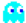
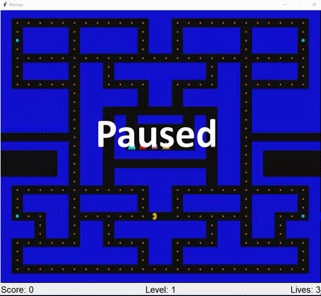
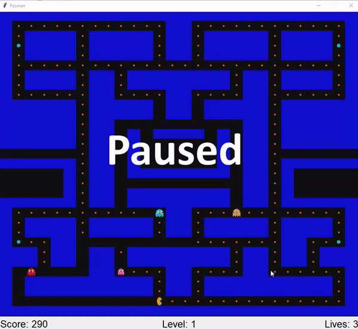
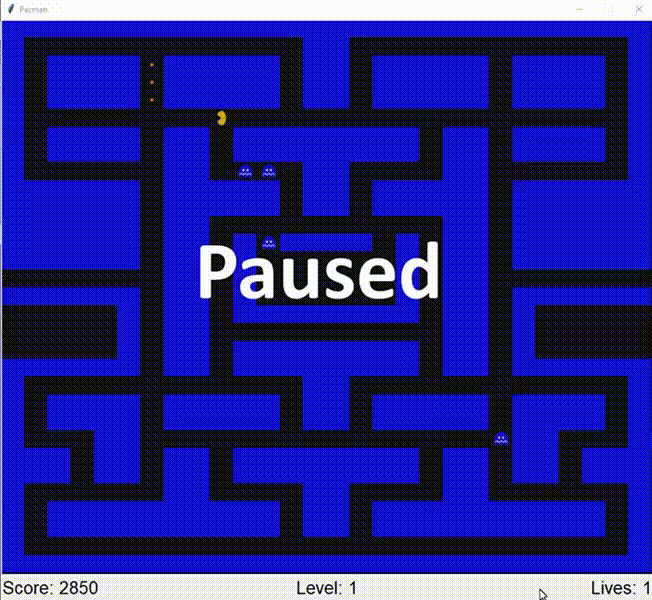

# Pacman
A Python influenced-version of the well known arcade game, Pacman. The game immediately starts when the `main.pyw` file is ran. The program does not contain a Main Menu, but does include levels and acceleration of the game. Losing all the lives results in a Game Over screen, and the program is done.

# Requirements
- Python must be installed: https://www.python.org/downloads/ - (Python 2 not supported)
- Latest version of Pillow must be installed: https://pillow.readthedocs.io/en/stable/

# Libraries Used
`tkinter` - Graphics library that allows the game to be playable with constant updates  
`os`- Supported the GameImage class, and allowed images to be organized in it's own directory  
`PIL.ImageTk` - Handles the special images used for Pacman, Enemies, and Pickup objects  
`collections.deque` - Data structure required in the Breadth First-Search Algorithm, which was required to for the enemies pathfinding  
`random` - Allowed random movement for certain enemies that had their own unique movement  

# Instructions / Hot Keys
<h4> Movement </h4>

<h4> Player Movement </h4>
`W` -> Upward Movement         
`A` -> Leftward Movement       
`D` -> Downward Movement       
`S` -> Rightward Movement      

<h4> Other </h4>
`esc` -> Pauses the Game  

<h4> Enemy Movement </h4>
 Blinky attempts to chase Pacman from directly behind.
 Pinky attempts to ambush Pacman from the front, depending on the position can
lead to Pinky chasing from behind.
 Clyde has completely random movement on the board.
 Inky can have an equal chance of any of the previous Ghost's movement for
any duration amount of time.

# Demonstration #

## Acquiring Points and Boost

## Gameplay

## Level Completion and Transitioning

## Gameover

