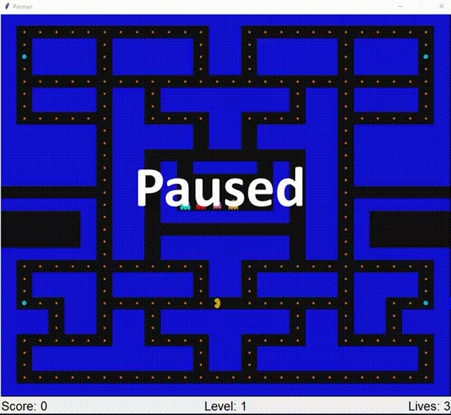
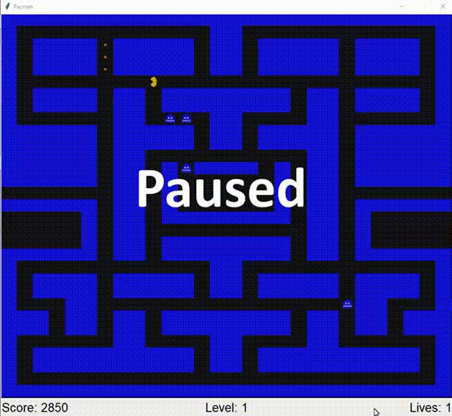

# Pacman
A Python influenced-version of the well known arcade game, Pacman. The game immediately starts when the `main.pyw` file is ran. The program does not contain a Main Menu, but does include levels and acceleration of the game. Losing all the lives results in a Game Over screen, and the program is done.

# Libraries Used
`tkinter` - Graphics library that allows the game to be playable with constant updates.  
`os`- Supported the GameImage class, and allowed images to be organized in it's own directory.  
`PIL.ImageTk` - Handles the special images used for Pacman, Enemies, and Pickup objects. 
`collections.deque` - Data structure required in the Breadth First-Search Algorithm, which was required to for the enemies pathfinding. 
`random` - Allowed random movement for certain enemies that had their own unique movement. 

# Instructions / Hot Keys
<h4> Movement </h4>

`W` -> Upward Movement         
`A` -> Leftward Movement       
`D` -> Downward Movement       
`S` -> Rightward Movement      

<h4> Other </h4>
`esc` -> Pauses the Game  

# Demonstration #
Link added later

